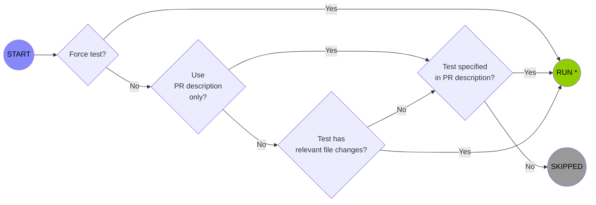

```mermaid
flowchart LR
    A((START)) --> B{Force test?};
    B --> |Yes| C((RUN *));
    B --> |No| D{Use\n PR description\nonly?};
    D --> |Yes| E{Test specified\nin PR description?};
    E --> |Yes| C ;
    E --> |No| G((SKIPPED));
    D --> |No| H{Test has\nrelevant file changes?};
    H --> |Yes| C;
    H --> |No| E;

    style A fill:#8689F9,color:#000;
    style C fill:#8fce00,color:#000;
    style G fill:#999,color:#000;
```