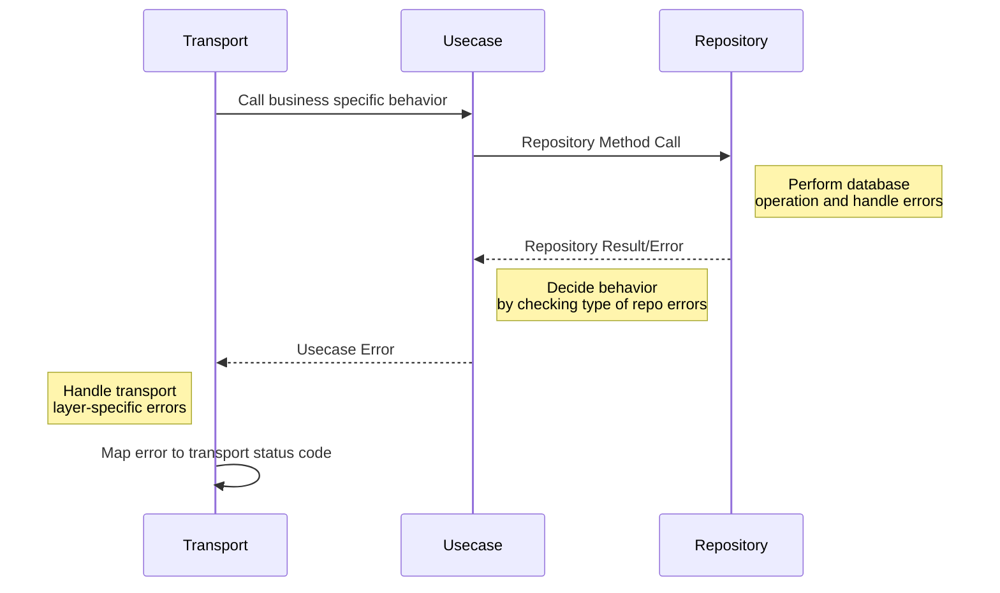

# LMS 2.0 - Learning Management System V2

This is the new service for LMS 2.0 and its incoming endpoints.
As part of an effort in reducing development issues.

## Coding standard

Conventions below are not strictly followed, but should be considered carefully.


### Go recommends
As far as good, but we should consider these things:

- The pointer **should not** be used everywhere.
- Use pointer for 3 cases (and if you consider that it is needed):
    - Receiver method (eg `func (*BookDto) TableName() string`).
    - Modify input without returning (see `mastermgmt/shared/validators`)
    - Big structs
    - Prevent ambiguous when having error: `GetAssessmentSubmission(ctx context.Context, id string) (sub *domain.Submission, err error)`
- **Don't use** pointer for: Slices, maps, channels, strings, function values, and interface.
    - Their values are implemented with pointers internally, and a pointer to them is often redundant.
    - Consider carefully between these types:
      - `books []*Book` (bad performance in normal, but effective in some rare cases coping directly pointers)
      - `books []Book` (underlying array already be placed in the heap if it is big enough)
- Use pointer at wrong place will just increase the workload of the Garbage collector, and do not improve the performance.
- ...

### Architecture / Structure

- Transport layer: The validation logic, transportation logic
- Usecase layer: Business logic of the API endpoint (or command, query).
- Domain: Domain Entity, the core of the system. It should use Go data types, not any from `pgtype`
  - It could contain business abstractions
- Repository layer: Just responsible for transporting data from database dialect into our domain layer.
    - DO NOT use business logic on this.
    - Responsible on data mapping.

- If we have any external domain (replicate from others), consider it as an aggregate module
  - Eg: book_user module.
- Interface should not have any related types of dependencies like Postgres or Mongodb in order to make our architect loosely-coupled.
  - Dependencies should be placed in struct implementation, see BookRepo example:
    ```go
    package repository
    type BookRepo interface {
	    Upsert(ctx context.Context, books []domain.Book) error
    }
    // package postgres 
    type BookRepo struct {
	    DB database.Ext
    }
    // package mongo
    type BookRepo struct {
	    Client *mongo.Client
    }
    ```
- For complicated usecase that have to use separated usecase model, DTO and domain aggregate: Take an insight from [DDD forum](https://github.com/stemmlerjs/ddd-forum) then open a thread to discuss.
    

... And your contributions.

### Error handling
Like clean architecture, error should be separated into 3 layers respectively.

Eg: When a repository return `pgx.ErrNoRows` = `common.ErrNoRowsExisted`, we can map it to an `EntityNotFound` error, then transport layer can decide which status code to return (404 or GRPC NotFound).

We can define specific error type based on `common.AppError` type at each layer. This makes it easier to deal with biz decision making.


### DDD
- Any entity that is dependent on other entity should be in the same with the root one. (Book module: Chapter, Topic, LOs...)
- Before deciding to put the entity inside any module, please make sure that you have the context boundary diagram.


### Unit testing

We test 3 layers:
- Repository: Mock DB
- Usecase: Mock repositories
- Transport: Mock usecases

To mock new stuffs:
1. Add mocking usecase and repositories into the `genEurekaV2` function
2. Run:
```bash
make gen-mock-v2
```

### BDD tests
Just name the bdd function like normal code:
- DON'T: `aValidResponseIsReturned()`, `ourSystemMustUpdateTheBooksCorrectly()`...
- DO: `checkSuccessResponse()`, `checkCreatedBook()`

### References
- [Bad Go: Slice of Pointers](https://philpearl.github.io/post/bad_go_slice_of_pointers/)
- [[LMS v2] New backend module architecture](https://manabie.atlassian.net/wiki/spaces/TECH/pages/701235276/LMS+v2+New+backend+module+architecture)
- [DDD forum, following strictly DDD and Clean architecture](https://github.com/stemmlerjs/ddd-forum)
