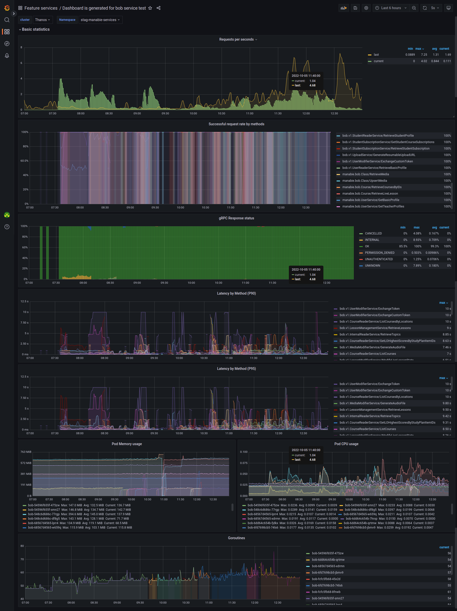
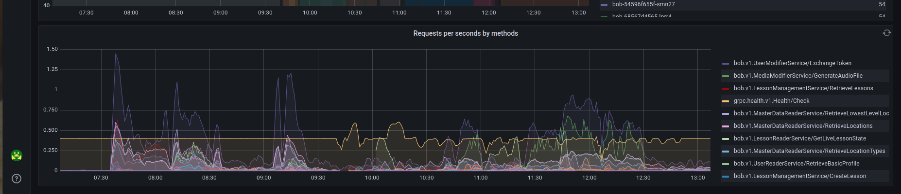

## Overview
- Currently, if we want to create a Grafana dashboard, we often use UI and copy json config into our repo.
- And We have to manager folder which contains dashboard configs JSON files.

=> Maintain a set of dashboards for people with conflicting preferences and goals. 
Or you’re dealing with confusion because one graph shows errors in one color and a new one uses a different color. 
Or there’s a new feature in Grafana and you need to change 50 dashboards to use it. 
As a result, making sure your dashboards work and look good is no longer a simple process.

=> That’s why we want to use your dashboard as code.

## Jsonnet
A data templating language for app and tool developers

- Generate config data
- Side-effect free
- Organize, simplify, unify
- Manage sprawling config

The example:
- You define a local variable and then that same local variable is referenced later:
```
local greeting = "hello world!";

{
 foo: "bar",
 dict: {
    nested: greeting
 },
} 
```
=>
```
{
 "foo": "bar",
 "dict": {
    "nested": "hello world!"
 }
} 
```
- Or, use functions:
```
// A function that returns an object.
local Person(name='Alice') = {
  name: name,
  welcome: 'Hello ' + name + '!',
};
{
  person1: Person(),
  person2: Person('Bob'),
}
```
=>
```
{
  "person1": {
    "name": "Alice",
    "welcome": "Hello Alice!"
  },
  "person2": {
    "name": "Bob",
    "welcome": "Hello Bob!"
  }
}
```
- Patches: You call your Jsonnet function and append to it the snippet of JSON, and it simply adds — overwrites: like so:
```
dashboard: {
  new(title, uid): {...}
}

dashboard.new(...) + {
 schemaVersion: 22,
}
```
=>
```
{
  "title": "super dash",
  "uid": "my-dash",
  "Panels": [],
  "schemaVersion": 22
}
```
- Imports: Not only can you create functions, but you also can put those functions into files.
```
{
  alertlist:: import 'alertlist.libsonnet',
  dashboard:: import 'dashboard.libsonnet',
  gauge:: error 'gauge is removed, migrate to gaugePanel',
  gaugePanel:: import 'gauge_panel.libsonnet',
}
```

## Grafonnet 
- Is a very simple library that provides you with the basics: creating a dashboard, creating a panel, creating a single stat panel, and so on.
- https://github.com/grafana/grafonnet-lib
- See more: https://grafana.github.io/grafonnet-lib/
- Examples: https://github.com/grafana/grafonnet-lib/tree/master/examples

## Grafana builder tool
- We made a builder tool at `internal/golibs/grafanabuilder/grafana.go`
- It receives a dashboard config and relate other files (jsonnet format), will build to dashboard config json.
- (unstable features) Update new dashboard which is created by this tool to grafana config, to can show in list menu.

### Usage
- First, we have one `dashboard.jsonnet` jsonnet file, maybe call it is main file which will evaluates it to json file
```
local grafana = import 'grafonnet/grafana.libsonnet';
local dashboard = grafana.dashboard;
local annotation = grafana.annotation;
local template = grafana.template;
local graphPanel = grafana.graphPanel;
local prometheus = grafana.prometheus;

dashboard.new(
  'title',
  editable=true,
  refresh='5s',
  time_from='now-6h',
  time_to='now',
  timepicker={},
  schemaVersion=27,
  uid='uid',
)
.addAnnotation(annotation.default)
.addTemplate(
  template.datasource(
    name='cluster',
    query='prometheus',
    current='Thanos',
    hide='',
  )
)
.addTemplate(
  template.new(
    name='namespace',
    datasource='${cluster}',
    query={
        query: 'label_values(grpc_io_server_completed_rpcs, namespace)',
        refId: 'StandardVariableQuery'
    },
    label='Namespace',
    hide='',
    refresh='load',
    definition='label_values(grpc_io_server_completed_rpcs, namespace)'
  )
)
.addPanel(
  graphPanel.new(
    title='Number of requests',
    datasource='${cluster}',
    fill=1,
    legend_show=true,
    lines=true,
    linewidth=1,
    pointradius=2,
    stack=true,
    shared_tooltip=true,
    value_type='individual',
  ).resetYaxes().
  addYaxis(
    format='none',
  ).addYaxis(
    format='short',
  ).addTarget(
    prometheus.custom_target(
        expr='expr',
        legendFormat='legendFormat',
    )
  ), gridPos={
    x: 0,
    y: 1,
    w: 18,
    h: 10,
  }
)
```

```
func main() {
    cfg, _ := os.Open("dashboard.jsonnet")
	defer cfg.Close()
	
	err = (&Builder{}).
		AddDashboardConfigFiles(cfg, nil).
		AddDestinationFilePath("res.json").
		Build()
	if err != nil {
	    panic(err)
	}
}
```

- Result file will look like this:
```
{
   "__inputs": [ ],
   "__requires": [ ],
   "annotations": {
      "list": [
         {
            "builtIn": 1,
            "datasource": "-- Grafana --",
            "enable": true,
            "hide": true,
            "iconColor": "rgba(0, 211, 255, 1)",
            "name": "Annotations & Alerts",
            "type": "dashboard"
         }
      ]
   },
   "editable": true,
   "gnetId": null,
   "graphTooltip": 0,
   "hideControls": false,
   "id": null,
   "links": [ ],
   "panels": [
      {
         "aliasColors": { },
         "bars": false,
         "dashLength": 10,
         "dashes": false,
         "datasource": "${cluster}",
         "fill": 1,
         "fillGradient": 0,
         "gridPos": {
            "h": 10,
            "w": 18,
            "x": 0,
            "y": 1
         },
         "hiddenSeries": false,
         "id": 2,
         "legend": {
            "alignAsTable": false,
            "avg": false,
            "current": false,
            "max": false,
            "min": false,
            "rightSide": false,
            "show": true,
            "sideWidth": null,
            "total": false,
            "values": false
         },
         "lines": true,
         "linewidth": 1,
         "links": [ ],
         "nullPointMode": "null",
         "percentage": false,
         "pointradius": 2,
         "points": false,
         "renderer": "flot",
         "repeat": null,
         "seriesOverrides": [ ],
         "spaceLength": 10,
         "stack": true,
         "steppedLine": false,
         "targets": [
            {
               "expr": "expr",
               "legendFormat": "legendFormat",
               "refId": "A"
            }
         ],
         "thresholds": [ ],
         "timeFrom": null,
         "timeShift": null,
         "title": "Number of requests",
         "tooltip": {
            "shared": true,
            "sort": 0,
            "value_type": "individual"
         },
         "type": "graph",
         "xaxis": {
            "buckets": null,
            "mode": "time",
            "name": null,
            "show": true,
            "values": [ ]
         },
         "yaxes": [
            {
               "format": "none",
               "label": null,
               "logBase": 1,
               "max": null,
               "min": null,
               "show": true
            },
            {
               "format": "short",
               "label": null,
               "logBase": 1,
               "max": null,
               "min": null,
               "show": true
            }
         ],
         "yaxis": {
            "align": false,
            "alignLevel": null
         }
      }
   ],
   "refresh": "5s",
   "rows": [ ],
   "schemaVersion": 27,
   "style": "dark",
   "tags": [ ],
   "templating": {
      "list": [
         {
            "current": {
               "text": "Thanos",
               "value": "Thanos"
            },
            "hide": 0,
            "label": null,
            "name": "cluster",
            "options": [ ],
            "query": "prometheus",
            "refresh": 1,
            "regex": "",
            "type": "datasource"
         },
         {
            "allValue": null,
            "current": { },
            "datasource": "${cluster}",
            "definition": "label_values(grpc_io_server_completed_rpcs, namespace)",
            "hide": 0,
            "includeAll": false,
            "label": "Namespace",
            "multi": false,
            "name": "namespace",
            "options": [ ],
            "query": {
               "query": "label_values(grpc_io_server_completed_rpcs, namespace)",
               "refId": "StandardVariableQuery"
            },
            "refresh": 1,
            "regex": "",
            "sort": 0,
            "tagValuesQuery": "",
            "tags": [ ],
            "tagsQuery": "",
            "type": "query",
            "useTags": false
         }
      ]
   },
   "time": {
      "from": "now-6h",
      "to": "now"
   },
   "timepicker": { },
   "timezone": "browser",
   "title": "title,
   "uid": "uid",
   "version": 0
}
```

## Basic dashboard
- We have built a basic dashboard which have go template form to put variable into.
- It will receive list services(required).
- And list methods or exception method (option) and proto files to get list grpc method or to validate (option).

### we have 3 way to use this tool:
- First way, we just need get dashboard which was defined. This is the easiest way to use:
```
func main() {
    main, extension, err := NewGRPCDashboardConfig().
		AddUIDAndTitle("id-0000", "hello world").
		AddServiceNames("bob").
		Build()
	if err != nil {
	  panic(err)
	}

	err = (&Builder{}).
		AddDashboardConfigFiles(main, extension).
		AddDestinationFilePath("res.json").
		Build()
	if err != nil {
	  panic(err)
	}	
}
```

And result dashboard will look like this:


- Second, we can add an extension panel which also was defined. Currently, we just have one extension panel is `Requests per seconds by methods`
```
func main() {
    main, extension, err := NewGRPCDashboardConfig().
		AddUIDAndTitle("id-0000", "hello world").
		AddServiceNames("bob").
		AddRequestsPerSecondsByMethodsPanel().
		Build()
	if err != nil {
	  panic(err)
	}

	err = (&Builder{}).
		AddDashboardConfigFiles(main, extension).
		AddDestinationFilePath("res.json").
		Build()
	if err != nil {
	  panic(err)
	}	
}
```
And `Requests per seconds by methods` panel will look like this:


- Or if we want more customization, we can completely write the configuration directly in jsonnet format.

To customize, we need at least 2 files like below (see at `internal/golibs/grafanabuilder/template`):
  file main to execute to final result json config(`main.jsonnet`):
```
local dashboard =  import 'default_dashboard_cfg.jsonnet'; // this is file which our tool provide
local properties =  import 'default_dashboard_properties.jsonnet';
local gridPos = import 'grid-pos.jsonnet'; // thís is file you need add
local grafana = import 'grafonnet/grafana.libsonnet';
local graphPanel = grafana.graphPanel;
local prometheus = grafana.prometheus;
local row = grafana.row;
// you can also import other pannels if you need, see more "internal/golibs/grafanabuilder/grafonnet"

dashboard
.addPanel(
  row.new(
    title='Title Row',
    titleSize='h6',
  ), gridPos=gridPos.gridPos[0]
).
addPanel(
  graphPanel.new(
    title='title',
    datasource=properties.datasource,
    fill=1,
    legend_show=false,
    pointradius=2,
    value_type='individual',
  ).resetYaxes().
  addYaxis(
    format='none',
  ).addYaxis(
    format='short',
  ).addTarget(
    prometheus.custom_target(
        expr='expr',
        legendFormat='legendFormat',
    )
  ), gridPos=gridPos.gridPos[1]
)
```

And another file to fill grid position(`grid-pos.jsonnet`):
```
// Value in this file will be fill in when genera tool is executed
{
    gridPos: [
        {
            h: 1, w: 24, x: 0, y: {{ calculateYByHeight 1 }},
        },
        {
            h: 9, w: 24, x: 0, y: {{ calculateYByHeight 9 }},
        },
    ],
}
```
And use them to build dashboard config:
```
func main() {
    main, extension, err := NewGRPCDashboardConfig().
		AddUIDAndTitle("id-0000", "hello world").
		AddServiceNames("bob").
		AddCustomExtensionFiles(map[string]string{"grid-pos.jsonnet": "grid-pos.jsonnet"}).
		Build()
	if err != nil {
	  panic(err)
	}
	extension["default_dashboard_cfg.jsonnet"] = main
	
	f, err := os.ReadFile("main.jsonnet")
	if err != nil {
		panic(fmt.Errorf("could not read custom dashboard config"))
	}
	customMain := &bytes.Buffer{}
	_, err = customMain.Write(f)
	if err != nil {
		panic(fmt.Errorf("could not read custom dashboard config data"))
	}

	err = (&Builder{}).
		AddDashboardConfigFiles(customMain, extension).
		AddDestinationFilePath("res.json").
		Build()
	if err != nil {
	  panic(err)
	}	
}
```