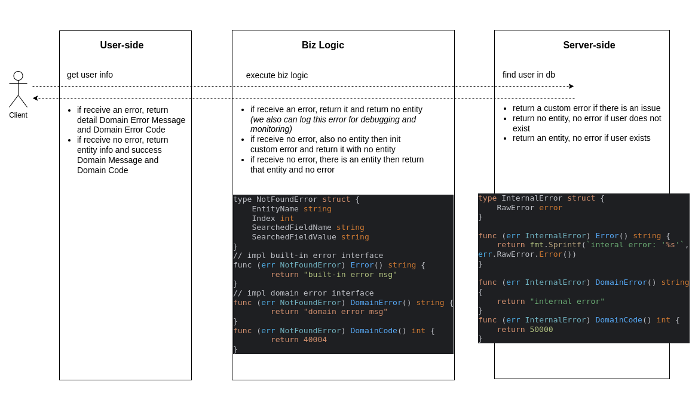

## Legacy Error Handling Flow
Normally, we can create a new error with formatting, or append additional information to existing errors to make a rich-information error by using std library of Golang
```go
line, column := 12, 24

// Create simple string-based error
simpleSyntaxErr := errors.New("syntax error")
// Append more information to existing error
wrappedSyntaxErr := errors.Wrap(simpleSyntaxErr, fmt.Sprintf("%d:%d", line, column))

// Error with formatting
formattedSyntaxErr := fmt.Errorf("%d:%d: syntax error", line, column)

fmt.Println(simpleSyntaxErr)    //output: syntax error
fmt.Println(wrappedSyntaxErr)   //output: 12:24: syntax error
fmt.Println(formattedSyntaxErr) //output: 12:24: syntax error
```

However, it's inconvenient to extract information from these errors that created by above methods because these are barely a string. To get `line` and `column` values, we have to extract and parse corresponding characters from the string pattern.

External packages expect to get detail information from errors to control the workflow based on them, and make an informative responses to clients but this error handling flow is a pain to do so.

## New Error Handling Flow

### Custom Error

By implementing the `Error` interface, we can define a new custom error.
A custom error should have detail information relates to it layer context.

```go
package validator

type SyntaxError struct {
	Line   int
	Column int
}

func (e SyntaxError) Error() string {
	return fmt.Sprintf("%d:%d: syntax error", e.Line, e.Col)
}

func Check(data string) error {
    // ... checking
    if syntaxValid {
        return nil
    }
    return SyntaxError{
        Line:   line,
        Column: column,
    }
}
```
When external packages receive an error, they can assert the error type and get the detail information from it easily.
```go
err := validator.CheckSyntax("test data")
switch err := err.(type) {
    case nil:
        fmt.Println("no err")
        // Perform next action...
    case validator.SyntaxError:   
        fmt.Println("encounter a syntax error, we can get detail information from it to handle", err.Line, err.Column)
        // Expected error type, so we can get detail information from it
        // Perform next action...
    default:
        fmt.Println("encounter an error, but is a unexpected error type")
        // The more error types we handle, the more we can avoid entering this case
        // Perform next action....
}
```

### Distinguish Error Messages

Whenever we log an error with built-in or third party logger, it automatically call the `Error(`) method to get the message to print out.
```go
err := validator.CheckSyntax("test data")
fmt.Prinln(err) // assuming line is 12 and column is 24, the output should be: "12:24: syntax error"
zapLogger.Error( // assuming line is 12 and column is 24, the output should be: "12:24: syntax error"
    "error occurs when get users",
    zap.Error(err), 
)
```
We can take advantage of this behavior to monitor our system with logging. By creating custom errors and handling the message pattern in `Error()` method, we can more useful, informative error messages.

There is a limitation, this type of message is not suitable to return to clients because it may contain information relates to our system status. And not only message, we may return more information like result code.

Although in endpoint handlers, we can parse detail information from a custom error then create a message/code for clients. It would be better if we have some convenient ways to handle like the logging behavior with `Error()` method.
```go
err := validator.CheckSyntax("test data")
switch err := err.(type) {
    case validator.SyntaxError:
	// We can get err.Line, err.Column to create client message/code
	// Ideally, can we have a magic method like "err.ClientMessage()" to get the final results for clients?
}
```
This is why we have another concept to deal with this issue, the Domain Error.

### Domain Error

To extend information about domain for an error and avoid conflicting with built-in error, we define another interface and let all Custom Errors implement it.
```go
type DomainError interface {
    DomainError() string
    DomainCode() int
}
```
As the result, each Custom Error implement both built-in `error` interface and `DomainError` interface.
```go
type InvalidFieldError struct {
	EntityName string
	Index      int
	FieldName  string
}
// implement built-in error interface
func (err InvalidFieldError) Error() string {
	return fmt.Sprintf(`%s of %s[%v] is invalid`, err.FieldName, err.EntityName, err.Index)
}
// implement DomainError interface
func (err InvalidFieldError) DomainError() string {
	return fmt.Sprintf(`%s[%v].%s invalid`, err.EntityName, err.Index, err.FieldName)
}
func (err InvalidFieldError) DomainCode() int {
	return errcode.DomainCodeInvalid
}
```

#### System Error message
The implemented `Error()` method should return a message that has context and information about system. Therefore, we don't return this type of message for client but use it in logging and monitoring instead.

In above Distinguish Error Messages section, we always use this type of error with logger.
#### Domain Error message
The implemented `DomainError()` and `DomainCode()` methods should return a message and a code that indicate issues that occur when domain resolve request.

We should not leak any information about our system, returned information should relate to
client's request.

## Error Handling Across Layers
Although we defined many custom errors, but we don't always need to assert exactly the defined type of custom error, we use defined custom error as built-in error type and domain error type instead.

Normally, domain service only cares whether the error occurs or not, and then log it for debugging, monitoring. And only user-side cares and asserts whether the error is domain error not to return the domain message and domain code to clients.

Please take a look at example code to see how we handle errors across user-side, biz log, service side.



# Good practices

### Handling Internal Error

In case of internal error, only a generic message like _"internal error"_ or _"something went wrong, please contact
staffs"_ is enough for `DomainError`. Clients don't to know detail issues, they need contact our staffs instead and we should avoid leaking information about our system.

However, messages in built-in errors must have detail information because we will log them and use them to monitoring and debugging.

### Built-in Error Message

Whenever we define a new custom error by implementing `Error` interface, the returned message in `Error()` method should
be contextual, human-readable. Because this method always be called by logger we log an error.

### Logging A Built-in Error

We should add some information about the context of caller.
```go
zapLogger.Error(
    "error occurs when validate users",
    zap.Error(err),
)
```

### Testing
Unit test shall guarantee the domain errors are return properly to clients.
